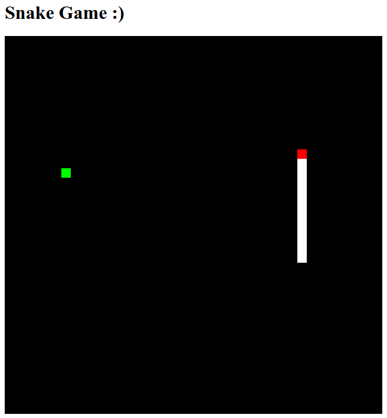

# JS&Node.js(SnakeGame)
Creating Snake Game using Javascript, Node.js &amp; Express.js

# What is Node.js & why do we use it here?

## What is Node.js

Node.js is an open source, server-side Javascript runtime, designed to build scalable network applications. Since it enables the use of Javascript on the server it has become extremely popular. Additionally, since it runs in a single thread, it is extremely efficient.

## Why do we use it here?

Due to browser security, Phaser games should be run on a web server so that the game can load resources. Visual Studio Code has a plugin that can be used to start a local web server and this would certainly suffice for this project. However it is both useful and instructive to understand a bit of Node.js and learn how to create a simple web server. Additionally Node.js can be used to enable real-time communication between clients via websockets, database access etc. So learning Node.js at this early stage will become very useful in more complex projects.
